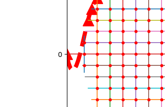

# 自动化的正过程

## 要实现的功能

- 采用模板文件的方式生成一个前处理脚本，可以给abaqus命令行执行
    - 脚本中集成工作目录、输出目录、文件命名等等信息
    - 脚本可以监控job完成状态
    - 把执行下一步放到上一层框架，也就是本“自动化”程序中
- 通过命令行的调用
    - Subprocess? 如何进程间交互?
    - 建模命令行对json文件的读取部分要改写
- 正过程的优化
    - 弱化对称轴的要求
- 交互文件全json化

## 计划
1. 先改造接口，全json化。
    1. 两段json文件，第一段是边界点的列表。
    2. 数据结构上，边界点需要区分是X轴的还是Y轴的。
    3. 内部点的生成要做判断。
    4. 根据改动后的边界点，读取json可生成平面预览效果。
    5. 根据边界点列表生成结构。
2. 把逆过程中截断的部分改造了，得到一个比较好的比较结果。
3. 回来做abaqus的命令行调用部分。

迭代中存在这样的问题...
放到生成Y向中解决?

## 进度
- 2017.9.25
    - 目前完成了初步的重构。在依赖样条曲线的情况下，
    提升了generate_y_coord、root的鲁棒性，
    采用xcoord和ycoord的结果生成incoord的方法改写generate_in_coord。
    - 增加单元测试，解耦程序的测试部分。
    - Utils中按前端输入、内部工具类等方法分类重构，提高代码的层次性。
- TODO:
    - 改写abaqus建模部分的代码，使得它能根据目前的json文件直接运行，
    目标效果: 以后不需要每次迭代时改abaqus建模部分的代码。
    - 改写代码使得job的submit是阻塞的，或者增加任务运行Abort/Complete的回调机制。
